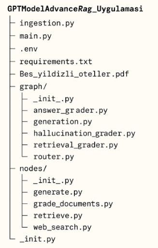
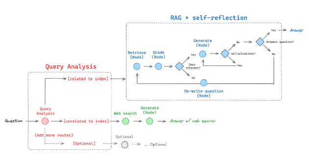
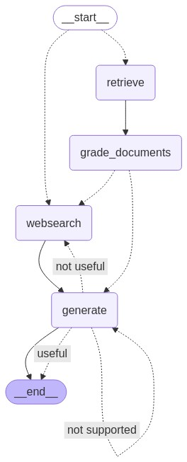

# 🏨 TurizmGPTChatBot

Türkiye’deki beş yıldızlı otellerle ilgili doğal dilde sorulara yanıt veren gelişmiş bir **RAG (Retrieval-Augmented Generation)** tabanlı chatbot. Bu projede, PDF verisinden alınan otel bilgileriyle desteklenmiş, LLM tabanlı sorgu-yanıt sistemi yer almaktadır.

---

## Dosya Yapısı

## 🚀 Graph Yapısı

### 🔴 Query Analysis (Sorgu Analizi) 

İlk aşamada sistem, gelen sorunun yapısını analiz ediyor.

Soru, iki temel kategoriye ayrılıyor:

[Related to index]: Soru, önceden oluşturulmuş vektör tabanlı bilgi dizinine uygunsa, sistem bu yolla devam eder.

[Unrelated to index]: Soru dış kaynaklardan bilgi gerektiriyorsa (örneğin güncel olaylar), bu durumda web search yoluna yönlendirilir.

### 🔵 RAG + Self-Reflection (RAG + Öz-Düşünüm) 

Eğer sorgu indekse uygun bulunursa, sistem aşağıdaki gibi çalışır:

Retrieve (Node): İlgili belgeler dizinden alınır.

Grade (Node): Bu belgelerin soruya uygunluğu değerlendirilir.

Generate (Node): Uygun belgelerle cevap oluşturulur.

Cevabın kalitesi test edilir:

Cevap soruyu cevaplıyor mu?

Cevapta çelişki (hallucination) var mı?

Eğer bir sorun varsa:

Soru yeniden yazılır (Re-write question node) ve süreç başa döner.

### 🟢 Web Search - Yeşil Alan

Eğer soru indekse uygun değilse, sistem:

Web search yapar.

Ardından Generate (Node) ile dış kaynağa dayalı bir cevap üretir.

Sonuç: Answer w/ web search

---

## 📦 Kullanılan Teknolojiler

- [kodlar](https://github.com/langchain-ai/langgraph/blob/main/examples/rag/langgraph_adaptive_rag.ipynb)
- [LangChain](https://www.langchain.com/)
- [LangGraph](https://github.com/langchain-ai/langgraph)
- [OpenAI API](https://openai.com/)
- [Tavily Search](https://www.tavily.com/)
- Python, PyPDF, Chroma, dotenv

---

## 🧩 Mimarideki Ana Akış

